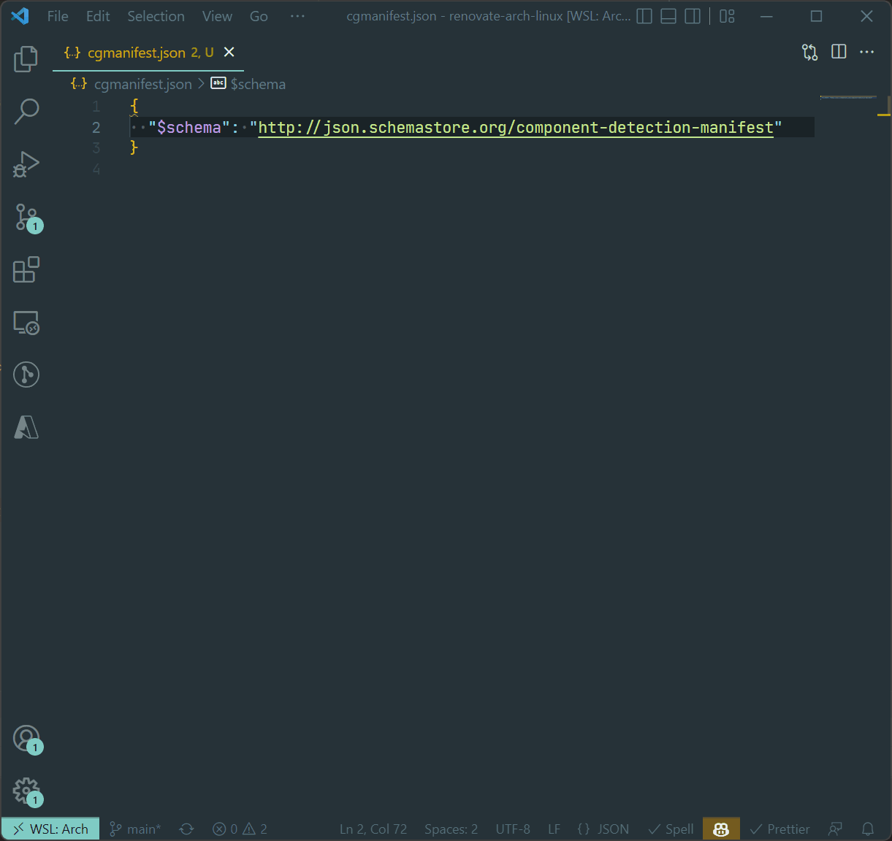

This repository contains an Octokit script that will automatically add [JSON Schema](https://json-schema.org/) to `cgmanifest.json` files.

## Setup

NOTE: This script requires [Node.js 18+](https://nodejs.org/en/download/).

1. [Create a GitHub Personal Access Token](https://github.com/settings/tokens) with the `repo` scope
2. Rename the `.env.sample` file to `.env`
3. Put your GitHub Personal Access Token in the `GITHUB_TOKEN` environment variable

## Logic

1. Search for any repositories that contain a `cgmanifest.json` file
2. For each repository:
    1. Check if the repository is archived or private
        - If yes, skip to next repository
    2. Check if the repository has already been forked to the Octokit user
        - If yes, fetch the fork
        - If no, create a fork
    3. Check if there is already a pull request for updating `cgmanifest.json`
        - If yes, skip to next repository
    4. Fetch the `cgmanifest.json` file from the current repository
    5. Add the `$schema` property to the `cgmanifest.json` file
    6. Format the `cgmanifest.json` file using `prettier`
    7. Check if the `cgmanifest-schema` branch exists in the fork
        - If yes, delete the existing `cgmanifest-schema` branch
   8. Create the `cgmanifest-schema` branch in the fork
   9. Update the `cgmanifest-schema` branch in the fork with the formatted `cgmanifest.json` file
   10. Create a pull request for the `cgmanifest-schema` branch from the fork

## FAQ

### Why?

We receive a lot of support request about `cgmanifest.json` files.
By providing a JSON Schema, it allows users to make sure that their `cgmanifest.json` file is valid, without asking us.
It also enables intellisense in Visual Studio Code and Visual Studio.

